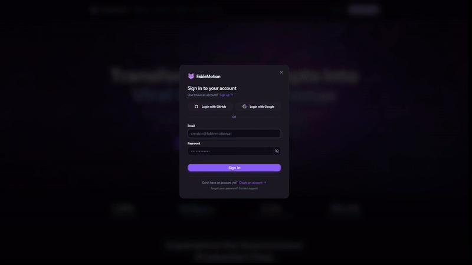

# Fable Motion: Enterprise Multimodal AI Video Pipeline

[](https://www.python.org/)
[](https://fastapi.tiangolo.com)
[](https://docs.pydantic.dev/)
[](https://nextjs.org/)
[](https://cloud.google.com/vertex-ai)
[](LICENSE)
[](#testing--quality-assurance)

An automated, fault-tolerant enterprise pipeline for vertical short-form cinema (9:16), orchestrating **Google Cloud Vertex AI & Google Gemini** (**Gemini 3.5 Flash-Lite**, **Imagen 3**, and **Veo 3.1 Fast**) with deterministic state recovery, decoupled media adapters, dynamic word-level subtitle synchronization, and full-stack observability.

---

> [!NOTE]
> ### 💼 Technical Recruiter & Engineering Hiring Showcase
> This repository is a curated architectural showcase of **Fable Motion**, a commercial multimodal AI video creation platform. While core proprietary prompt weights, fine-tuned character DNA datasets, and private SaaS endpoints remain protected under commercial IP, this repository exposes the **full system architecture, fault-tolerant state machine, decoupled provider adapters, LLMOps observability, testing framework, and Next.js web studio** to demonstrate engineering standards, design patterns, and distributed pipeline scalability.
>
> Evaluators are encouraged to inspect the architecture contracts, state resilience engine, adapter patterns, and run the automated test suite locally.

---

## 🏛️ System Architecture

<div align="center">
  
</div>

---

## 🎬 End-to-End Demo Walkthrough

Watch the complete pipeline in action—from screenplay conception, character bible synthesis, and keyframe rendering, through Veo 3.1 video clip generation, Faster-Whisper word-level subtitle burning, and the interactive Web Studio:

<div align="center">
  <a href="https://github.com/jaypiasco/fable-motion-showcase/raw/main/demo/FableMotion_demo.mp4">
    
  </a>
  <p>
    <em>Click preview above to stream in browser &bull; <a href="https://github.com/jaypiasco/fable-motion-showcase/raw/main/demo/FableMotion_demo.mp4"><strong>Stream Demo Video (MP4)</strong></a> &bull; <a href="https://github.com/jaypiasco/fable-motion-showcase/releases/download/v1.0.0/FableMotion_Full_Demo.mp4"><strong>Download Full-Res 1080p Master (108 MB)</strong></a></em>
  </p>
</div>

### What the Demo Highlights:
1. **Phase 1 (Screenplay & Scene Breakdown)**: Generates a 10–14 scene vertical story arc with a 3-second viral retention hook, Foley audio cues, and character dialogue.
2. **Phase 2 (Character Consistency Bibles)**: Synthesizes immutable character reference sheets and renders high-fidelity reference portraits saved to persistent assets.
3. **Phase 3 (Scene Keyframes)**: Synthesizes consistent scene stills conditioned directly on Phase 2 character portraits.
4. **Phase 4 (Veo 3.1 Motion Dynamics)**: Synthesizes 9:16 cinematic video clips with fluid camera movement, synchronized acoustics, and dialogue.
5. **Phase 5 (Dynamic Subtitles & Master Stitching)**: Transcribes audio using Faster-Whisper, generates word-level karaoke subtitles (`.ass`), burns captions, and stitches all scene clips with FFmpeg.
6. **Web Studio Dashboard**: Real-time visual monitoring, live WebSocket log streaming, RFC 7233 byte-range video playback, and queue management.
7. **Automated Social Publishing**: Pre-flight format compliance checks, automated SEO metadata generation, and one-click multi-channel publishing to YouTube Shorts, TikTok, Instagram Reels, and Facebook Reels (with n8n webhook automation).
8. **Langfuse Tracing & Token Cost Accounting**: Live distributed trace telemetry capturing LLM call latency, token usage breakdown, generation costs, and prompt inputs/outputs.
9. **Grafana Real-Time Telemetry**: Real-time system monitoring visualizing end-to-end pipeline throughput, stage latency histograms, and worker resource utilization.

---

## ⚡ Key Engineering & Architectural Highlights

### 1. Fault-Tolerant Distributed State Machine (`core/state_manager.py`)
- **Atomic Checkpointing**: Pipeline state is recorded as an atomic state machine stored at `./archive/{timestamp}_{story_slug}/pipeline_state.json`. All state updates write to an isolated temporary file before performing an atomic filesystem rename, eliminating corruption risk during power loss or abrupt termination.
- **Granular Phase & Item Resumption**: Checkpoints track each phase and individual scene/shot status. If a pipeline run is interrupted at Scene 7 during Phase 4, resuming the pipeline skips Scenes 1–6 and only renders missing items.
- **Graceful Interruption Capture**: Native POSIX/Windows `SIGINT` (`Ctrl+C`) handling flushes active work and transitions the pipeline state cleanly to `paused`, allowing zero-data-loss resume via `python orchestrator.py resume`.
- **Exponential Backoff with Jitter**: Automatic exponential backoff handling for API rate limits (`429 Too Many Requests`, `RESOURCE_EXHAUSTED`), progressively backing off from 5s to 300s with random jitter to prevent thundering herd problems.

### 2. Decoupled Media Provider Architecture (`services/media/`)
- **Adapter & Factory Design Patterns**: Built upon abstract base classes (`BaseImageProvider`, `BaseVideoProvider`, `BaseTTSProvider`, `BaseLipsyncProvider`), allowing zero-friction swapping between model vendors.
- **Multi-Vendor Routing**:
  - **Video**: Google Veo 3.1 Fast, Fal AI (Kling / Luma / Haiper).
  - **Images**: Google Imagen 3, Fal Flux.1 Schnell / Dev.
  - **Audio & Voiceover**: Edge TTS, ElevenLabs, Google gTTS.
  - **Lipsync**: Sync Labs, Passthrough.
- **Dynamic Provider Registry (`services/media/registry.py`)**: Centralized discovery and instantiation of media services driven purely by environment configuration.

### 3. Schema-Validated Creative Slot Compilation (`prompts/story_archetypes.py`)
- **Pydantic v2 Type Rigor**: Story concepts, cast profiles, environment progressions, and camera instructions are validated against strict Pydantic schemas (`StoryArchetypeConfig`, `CastMemberArchetype`, `EnvironmentArc`, `PlotBeat`).
- **Dynamic Slot Compilation**: Rather than hardcoded prompts, dynamic slot compilers assemble sampled archetypes into structured prompt templates, preventing repetitive tropes while maintaining rigid downstream JSON compatibility.

### 4. Audio-Visual Post-Processing Pipeline (`caption_pipeline.py` & `services/video_editor.py`)
- **Word-Level Subtitle Alignment**: Integrates **Faster-Whisper** to extract exact millisecond timestamps for each spoken word.
- **Stylized Dynamic Captions**: Generates SubStation Alpha (`.ass`) dynamic subtitles with custom typography, optical margins, and karaoke-style highlight effects burned directly into the 9:16 frame via FFmpeg.
- **Lossless Stream Multiplexing**: Audio-video stitching with timebase re-encoding fallbacks to prevent PTS/DTS desynchronization across clips rendered by generative video models.

### 5. Production Web Studio & Telemetry (`server.py` & `frontend/`)
- **RFC 7233 Byte-Range Streaming (`api/routes_media.py`)**: Native HTTP partial-content support for seamless video seeking and instant frame scrub in the studio UI.
- **Real-Time WebSocket Console**: Broadcasts structured log events (`INFO`, `WARNING`, `ERROR`) to connected browser clients with zero polling overhead.
- **Next.js 15 App Router Studio**: High-performance responsive dashboard with WebGL/WGSL background shaders, interactive phase steppers, and asset lightboxes.
- **LLMOps & Distributed Tracing (`services/langfuse_tracer.py`)**: Full trace attribution across all LLM and image calls (token consumption, latency, cost attribution).
- **Prometheus & Grafana Telemetry (`monitoring/`)**: Native Prometheus metrics collector tracking story generation throughput, stage latency, and provider failure rates.

---

## 🔄 5-Phase End-to-End Workflow

<div align="center">
  
</div>

---

## 📐 Design Patterns Implemented

| Pattern | Module | Purpose |
| :--- | :--- | :--- |
| **State Pattern** | `core/state_manager.py` | Manages pipeline phases, transitions, and atomic recovery. |
| **Adapter Pattern** | `services/media/` | Decouples third-party generative media APIs behind uniform interfaces. |
| **Factory Pattern** | `services/media/registry.py` | Dynamically instantiates media providers based on runtime settings. |
| **Slot Compilation** | `prompts/story_archetypes.py` | Compiles dynamic archetypes into validated prompt templates. |
| **Circuit Breaker / Retry** | `core/retry.py` | Exponential backoff with jitter for LLM rate limits (HTTP 429). |
| **Observer Pattern** | `server.py` | WebSocket streaming of server logs to web clients in real time. |
| **CQRS / Queue** | `core/queue.py` | Decouples job submission from background daemon execution. |

---

## 📂 Project Organization

```
fable-motion-showcase/
├── README.md                     # Showcase documentation & architectural deep dive
├── DESIGN.md                     # Design tokens, layout standards & UI architecture
├── PIPELINE_SPEC.md              # Detailed phase specifications & checkpoint contracts
├── pipeline_state_schema.json    # JSON Schema definition for runtime state validation
├── pyproject.toml                # Modern PEP 621 package build, metadata & dependencies
├── requirements.txt              # Pinned production Python dependencies
├── package.json                  # Workspace scripts (UI, dev server, daemon tasks)
├── Dockerfile                    # Production container build specification
├── ecosystem.config.js           # PM2 daemon configuration for unattended execution
├── .env.example                  # Environment configuration template
├── LICENSE                       # Source-Available / Showcase Recruiter Evaluation License
│
├── core/                         # Core infrastructure & runtime primitives
│   ├── state_manager.py          # Atomic state persistence, checkpointing & recovery
│   ├── state_schema.py           # Pydantic v2 models for Story, Scene, Shot, Character
│   ├── retry.py                  # Exponential backoff handler (rate limits, timeouts)
│   ├── sanitizer.py              # Visual prompt and dialogue sanitization
│   ├── cancellation.py           # Async cooperative cancellation tokens
│   ├── logger.py                 # Structured console and rotating file logger
│   └── queue.py                  # Story queue management & FIFO processing
│
├── pipeline/                     # Pipeline execution & media assembly
│   ├── story_pipeline.py         # Main pipeline coordinator
│   └── assembly.py               # Master video concatenation & audio muxing
│
├── phases/                       # Pipeline phase implementation controllers
│   ├── phase1_script.py          # Phase 1: Script & Storyboard synthesis
│   ├── phase2_characters.py      # Phase 2: Character consistency bibles & asset render
│   ├── phase3_images.py          # Phase 3: Keyframe image generation
│   ├── phase4_motion.py          # Phase 4: Video motion prompting
│   └── phase5_video.py           # Phase 5: Veo video generation & master concatenation
│
├── services/                     # External integration layer & API clients
│   ├── media/                    # Decoupled media provider abstraction layer
│   │   ├── base.py               # Abstract base classes (Image, Video, TTS, Lipsync)
│   │   ├── registry.py           # Dynamic provider registry & factory
│   │   ├── video/                # Google Veo & third-party video adapters
│   │   ├── images/               # Google Imagen & Flux image adapters
│   │   └── tts/                  # Edge TTS, ElevenLabs, gTTS adapters
│   ├── gemini_direct_client.py   # Direct Google Gemini REST API client
│   ├── quota_tracker.py          # Multi-account API key pool rotation
│   ├── langfuse_tracer.py        # LLMOps distributed tracing integration
│   ├── video_editor.py           # FFmpeg clip stitching and stream validation
│   └── gcs_storage.py            # Google Cloud Storage media persistence
│
├── prompts/                      # Creative DNA, archetype schemas & prompt framework
│   ├── dna.py                    # Runtime Character Style DNA and dynamic mutation
│   ├── story_archetypes.py       # Pydantic schema-validated archetypes & slot compilers
│   ├── presets.py                # Preset registration architecture
│   └── phase1_prompts.py ..      # Sanitized prompt framework & output schemas
│
├── presets/                      # Stylized character presets (baby_rhymes, filipino_characters, animal_characters, fruit_characters)
│
├── api/                          # Modular FastAPI web routes
│   ├── routes_stories.py         # Story generation and status endpoints
│   ├── routes_media.py           # RFC 7233 byte-range media streaming
│   ├── routes_system.py          # System telemetry and health checks
│   └── routes_queue.py           # Story queue administration
│
├── monitoring/                   # Observability & telemetry infrastructure
│   ├── metrics.py                # Prometheus custom metrics collector
│   ├── prometheus.yml            # Prometheus scrape configuration
│   ├── docker-compose.yml        # Prometheus + Grafana stack
│   └── grafana/dashboards/       # Pre-configured Grafana telemetry dashboards
│
├── evals/                        # LLMOps & evaluation suites
│   ├── run_evals.py              # Automated quality, consistency & pacing evaluation runner
│   ├── evaluators.py             # Evaluation rubrics and LLM-as-a-judge scorers
│   └── test_cases.json           # Benchmark evaluation test cases
│
├── tests/                        # Automated test hierarchy (26+ tests)
│   ├── unit/                     # Unit tests (archetypes, sanitizers, state, retry)
│   └── integration/              # Integration tests (pipeline flow, provider mocks)
│
├── frontend/                     # Source Next.js 15 Web Studio (TypeScript + Tailwind)
│   ├── app/                      # Next.js App Router pages (create, editor, library)
│   ├── components/studio/        # Pipeline flow visualizer, phase stepper, log viewer
│   └── components/ui/            # WebGL/WGSL background shaders & UI primitives
│
└── demo/                         # Showcase media assets
    ├── FableMotion_demo.mp4      # Full 1080p demo walkthrough video
    ├── demo_preview.gif          # Lightweight animated preview
    └── demo_poster.jpg           # High-resolution poster frame
```

---

## 🧪 Testing & Quality Assurance

The codebase includes comprehensive unit, integration, and evaluation suites:

```bash
# Run unit test suite (archetypes, state manager, sanitizers, retry logic)
pytest tests/unit -v

# Run integration test suite (pipeline state recovery, provider registry, FFmpeg)
pytest tests/integration -v

# Run full test suite with coverage
pytest tests/ -v --cov=.

# Run LLMOps automated evaluation rubrics
python evals/run_evals.py
```

### Test Coverage Highlights:
- **State Recovery**: Verifies checkpoint persistence and resuming partially rendered stories.
- **Provider Registry**: Tests dynamic resolution and instantiation of video, image, and TTS adapters.
- **Content Sanitization**: Validates prompt defense rules, filtering out disallowed artifacts and formatting.
- **Archetype Slot Compilation**: Tests deterministic sampling and dynamic slot injection.
- **Media Processing**: Validates FFmpeg video concatenation, audio muxing, and Faster-Whisper `.ass` subtitle rendering.

---

## 🚀 Quickstart & Local Reproduction

### 1. Prerequisites
- Python 3.11+
- Node.js 18+ (for Web Studio)
- FFmpeg (installed and accessible via `PATH`)
- (Optional) Google Gemini API Key

### 2. Installation
```bash
# Clone the showcase repository
git clone https://github.com/jaypiasco/fable-motion-showcase.git
cd fable-motion-showcase

# Create and activate a Python virtual environment
python -m venv .venv
source .venv/bin/activate  # On Windows: .venv\Scripts\activate

# Install dependencies
pip install -r requirements.txt

# (Optional) Install frontend studio dependencies
cd frontend
npm install
cd ..
```

### 3. Environment Setup
```bash
cp .env.example .env
# Edit .env to add your GEMINI_API_KEYS (optional for mock runs)
```

### 4. Running the CLI Orchestrator
```bash
# Execute a story run
python orchestrator.py run --prompt "A cyberpunk courier racing through a rain-drenched Neo Tokyo"

# Resume an interrupted story run
python orchestrator.py resume

# Inspect pipeline status
python orchestrator.py status
```

### 5. Running the Web Studio Dashboard
```bash
# Launch the FastAPI studio backend (served with UI)
python server.py --port 8000
```
Open **http://localhost:8000** in your browser to inspect the interactive story pipeline, phase checkpoints, live logs, and generated media.

---

## 📄 License & Recruiter Evaluation Terms

Copyright © 2026 John Paul D. Elias. All Rights Reserved.

This repository is published under a **Source-Available / Showcase License**.  
- **Permitted**: Technical recruiters, hiring managers, and interviewers are granted permission to browse, review, clone, and execute this repository locally solely for the purpose of assessing technical competence, software engineering standards, and employment suitability.
- **Restricted**: Commercial exploitation, SaaS hosting, redistributing, closed-source sublicensing, and training commercial AI models on this proprietary architecture are strictly prohibited without prior written authorization. See [`LICENSE`](LICENSE) for full legal terms.
